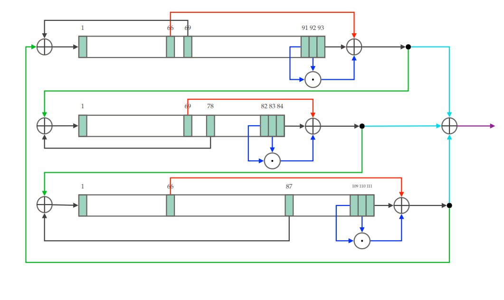

# Rust implementation of trvium stream cipher

## Structure
- Trivium consists of three LFSR’s of degrees 93, 84, and 111 for a total of 288 bits in the state
- The output of each LFSR is combined (XOR-ed) with the output of another LFSR before replacing the bit at the left-most position (Green)
- Two bits of each LFSR are combined (AND-ed) and then XOR-ed with the output (Blue)
- This is XOR-ed with another cell from the LFSR (Red)
- The results of the above steps for each LFSR are XOR-ed together and their value is the output at the current step (Light Blue)

*S. Kaleyski, N. (2023) 'Trivium' [Lecture], INF143/a: "Anvendt kryptografi". UiB. 26. January.*
